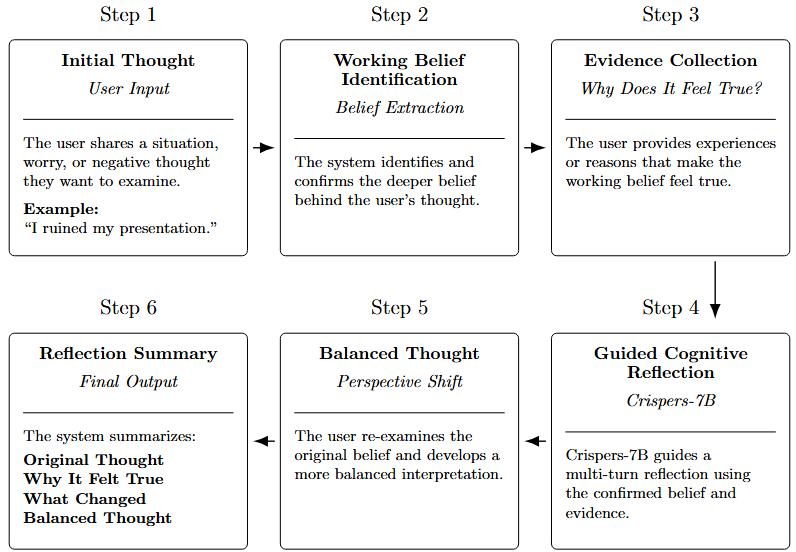

# Still True
*An AI-guided Cognitive Restructuring tool that helps users examine whether negative thoughts still hold up against the evidence.*

## Inspiration & Overview

> **“Depression is about 1.5 times more common among women than among men.”**  
> *— World Health Organization, [Depressive disorder (depression)](https://www.who.int/news-room/fact-sheets/detail/depression), 2025*

> **23.4% of U.S. women experienced an anxiety disorder in the past year, compared with 14.3% of men.**  
> *— [National Institute of Mental Health, Any Anxiety Disorder](https://www.nimh.nih.gov/health/statistics/any-anxiety-disorder)*

Women experience anxiety and depression at disproportionately high rates, and difficult thoughts can become especially convincing when someone is stressed, anxious, or emotionally low. We wanted to create a tool that could help users slow down and examine those thoughts on their own instead of simply receiving reassurance.

**Still True** is an AI-guided Cognitive Restructuring tool inspired by Cognitive Behavioral Therapy (CBT). It helps users **identify the belief behind a negative thought, explore why it feels true, and reflect on the evidence before developing a more balanced perspective**.

Instead of asking users to simply “think positively,” 

Still True asks: "After looking at the evidence, is this thought still true?"

## Methodology

Still True uses two complementary language models, each assigned to a different part of the Cognitive Restructuring process.

- ### Crispers-7B — Cognitive Restructuring Dialogue
: is a language model specialized for multi-turn Cognitive Restructuring conversations. In Still True, it powers the guided reflection stage, using the user's confirmed belief and supporting experiences to explore the thought from different perspectives.

Rather than using Crispers as an unrestricted chatbot, Still True provides it with the context gathered during earlier stages so that the conversation stays focused on a specific belief and reflection goal.

- ### Qwen2.5 — Structured Insight Extraction
: handles the structured reasoning and extraction tasks around the conversation. It helps identify the user's underlying **working belief**, determines when that belief is clear enough to confirm, and extracts the key insights from the completed reflection.

At the end of a session, Qwen2.5 organizes the conversation into:
**Original Thought**, **Why It Felt True**, **What Changed**, **Balanced Thought**

By separating these roles, **Crispers focuses on the Cognitive Restructuring dialogue while Qwen focuses on identifying and organizing key information**, creating a more controlled and structured experience than relying on a single general-purpose chatbot.

## How It Works

## Features

- AI-guided Cognitive Restructuring
- Automatic extraction of key reflection insights
- User-confirmed belief identification
- Structured step-by-step guidance
- Personalized end-of-session summaries
- Downloadable reflection reports
- Safety checks for high-risk language

## Technology

### Frontend

### Backend

### AI

**Models:** Crispers-7B · Qwen2.5
